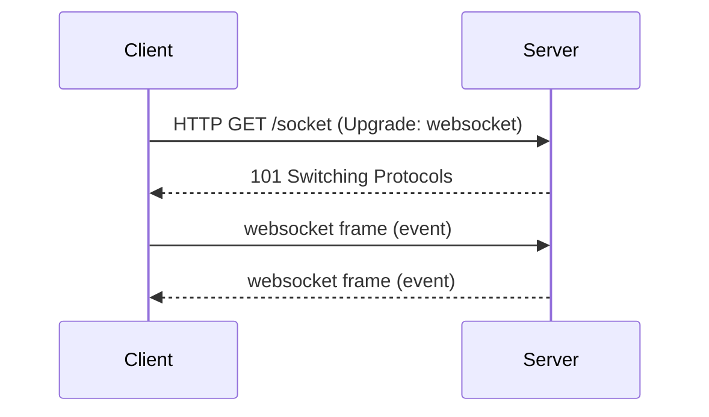

# Intro to Network Connections

## 1. How network connections usually work
- Most web apps use HTTP, an application layer protocol over TCP.
- The client initiates the conversation, the server responds, and the exchange is usually short-lived.
- HTTP is stateless: each request is independent unless the app adds cookies, tokens, or session state.

## 2. HTTP request methods
- `GET` retrieves data. Example: fetch a page or API resource.
- `POST` creates a new resource or submits data for processing.
- `PUT` updates a resource with a full payload.
- `PATCH` updates part of a resource.
- `DELETE` removes a resource.

### HTTP example
```http
GET /api/game-state HTTP/1.1
Host: example.com
Accept: application/json

HTTP/1.1 200 OK
Content-Type: application/json

{"players":[...],"tick":42}
```

### Update example
```http
PUT /api/profile/123 HTTP/1.1
Host: example.com
Content-Type: application/json

{"displayName":"Alex"}
```

## 3. Why HTTP is often not enough for realtime apps
- HTTP is request/response oriented: the server cannot send new data until the client asks again.
- For realtime updates, clients often poll the server repeatedly, which wastes bandwidth and adds latency.
- Long polling works, but it is still a workaround on top of a short-lived HTTP model.

## 4. WebSockets as a different model
- WebSocket starts with an HTTP upgrade handshake, then switches protocols.
- After the handshake, the same TCP connection stays open.
- Both client and server can send messages at any time.



## 5. What WebSockets are good for
- Multiplayer games where the server pushes position updates.
- Chat applications with real-time messages.
- Live dashboards and notifications.
- Collaborative tools where multiple users edit together.

## 6. When to use HTTP vs WebSocket
- Use HTTP for standard CRUD, page loads, form submissions, and APIs that do not need continuous updates.
- Use WebSocket when the app needs low-latency, bidirectional, ongoing communication.
- Many apps use both: HTTP for initial loading and auth, WebSocket for realtime events.

## 7. Key takeaway
- HTTP is the foundation of the web and works well for discrete requests.
- WebSocket builds on that foundation to keep a connection open and support realtime, event-driven communication.
