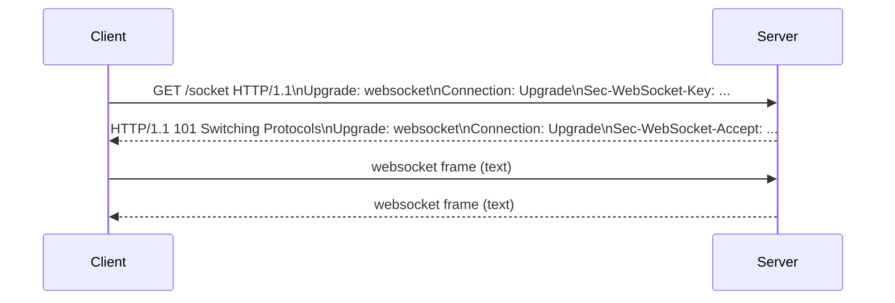

# WebSocket Programming

## What is WebSocket?
- WebSocket is a bidirectional communication protocol over a single TCP connection.
- It enables real-time data transfer with low latency.

## WebSocket handshake
- Client sends HTTP upgrade request with `Upgrade: websocket`.
- Server responds with `101 Switching Protocols`.



## Core concepts
- `open`: connection established
- `message`: data received
- `close`: connection closed
- `error`: transport error

## Basic browser API
```js
const ws = new WebSocket('ws://localhost:3001');
ws.onopen = () => console.log('open');
ws.onmessage = (ev) => console.log('message', ev.data);
ws.send(JSON.stringify({type:'ping'}));
``` 

## Server in Node.js
```js
const WebSocket = require('ws');
const wss = new WebSocket.Server({ port: 3001 });

wss.on('connection', ws => {
  ws.on('message', (msg) => { console.log('recv', msg); });
  ws.send('welcome');
});
```

## Use cases
- chat apps
- online games
- realtime dashboards
- collaboration tools

## Best practices
- handle reconnection
- authenticate on connection
- avoid sending huge messages
- add ping/pong heartbeat
