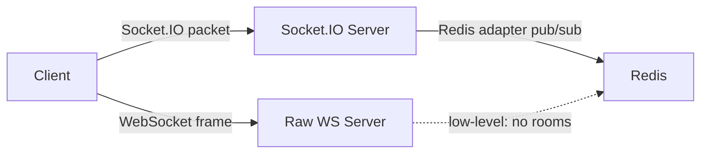

# Socket.IO vs Raw WebSocket

## Raw WebSocket
- Protocol-level API for bidirectional messaging.
- Very lightweight and minimal.
- Browser and `ws` package compatibility.
- No built-in reconnection or event system.

## Socket.IO
- Library on top of WebSocket (or long- polling fallback).
- Automatic reconnect, heartbeat, namespaces, rooms, middleware.
- Event-based (`socket.emit('event', data)`)
- Community ecosystem and server/client packages.

## Comparison
- **Reliability**: Socket.IO is more resilient (fallback paths + reconnection). WebSocket is lower-level and less automatic.
- **Feature**: Socket.IO built-in pub/sub (rooms), middlewares, auth flows. WebSocket needs custom protocol design.
- **Protocol**: Socket.IO has its own frame/envelope, not pure WebSocket.
- **Latency**: WebSocket can be slightly more efficient (less overhead), but Socket.IO is still very fast for most apps.

## When to use what
- Use raw WebSocket for very lightweight custom protocol where every byte counts.
- Use Socket.IO when you need fast iteration, room messaging, reconnect, and simple API.
