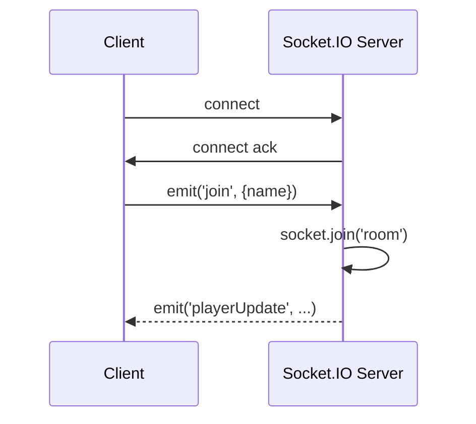

# Socket.IO Intro

## What is Socket.IO?
- JavaScript library for realtime web apps.
- Consists of client (`socket.io-client`) and server (`socket.io`).
- Provides event-based messaging, rooms, namespaces, and fallback transports.

## Basic usage
### Server
```js
const { Server } = require('socket.io');
const io = new Server(3001, { cors: { origin: '*' } });

io.on('connection', (socket) => {
  console.log('connected', socket.id);
  socket.on('join', (payload) => console.log('join', payload));
  socket.emit('welcome', 'hello');
});
```

### Client
```js
import { io } from 'socket.io-client';
const socket = io('http://localhost:3001');

socket.on('connect', () => console.log('connected', socket.id));
socket.on('welcome', data => console.log(data));
socket.emit('join', { name: 'player' });
```

## Key API
- `socket.on('event', cb)`
- `socket.emit('event', data)`
- `io.on('connection', socket => ... )`
- `socket.join('room')`, `io.to('room').emit(...)`

## Architecture diagram


## Advanced features
- Namespaces: `io.of('/admin')`
- Middleware: `io.use((socket, next) => ...)`
- Adaptive transports for broad browser support
